<link href="https://fonts.googleapis.com/css2?family=Press+Start+2P&display=swap" rel="stylesheet">

⚔️ Character Sheet ⚔️

<!-- Profile Heading -->
<h1 align="center" style="font-family: 'Press Start 2P', sans-serif;"><strong>XEVITHIRUS</strong></h1>

<!-- Character Info -->
<table align="center" border="0" cellpadding="0" cellspacing="0" style="border-collapse: collapse;">
<tr>
<!-- Image on the left -->
<td style="vertical-align:top; padding-right:20px;">
  
  </td>

<!-- Character Info on the right -->
<td>
  <table>
    <tr>
      <td><strong>Class:</strong></td>
      <td>Bit Basher</td>
    </tr>
    <tr>
      <td><strong>Specialization:</strong></td>
      <td>Full-Stack Developer</td>      
    </tr>
      <tr>
        <td><strong>Level:</strong></td>
        <td><!--level-->3<!--/level--></td>
      </tr>
      <tr>
        <td><strong>Total Experience:</strong></td>
        <td><!--total_exp-->380<!--/total_exp--></td>
      </tr>
      <tr>
        <td><strong>EXP Progress:</strong></td>
        <td>
          <!--to_next_level-->
           33%
          <!--/to_next_level-->
        </td>
      </tr>
      <tr>
        <td><strong>HP:</strong></td>
        <td>❤❤❤🤍🤍</td>
      </tr>
      </table>
    </td>
  </tr>
</table>

---
<!-- Attributes -->
<h2 align="center">🧮 Attributes</h2>

  

---
<!-- Abilities -->
<h2 align="center">☄️ Ability Tree</h2>

<h3 align="center">⚔️ Core Combat Arts</h3>
<table align="center">
<tr>
<td align="center" width="100">
 
<strong>C++</strong> 
◆
</td>
<td width="260">Forged for high-performance systems, game logic, and low-level problem slaying.</td>
<td align="center" width="100">
 
<strong>JavaScript</strong> 
◆◆
</td>
<td width="260">Channels dynamic behaviour into web interfaces and interactive front-end encounters.</td>
</tr>
<tr>
<td align="center" width="100">
 
<strong>Python</strong> 
◆◆
</td>
<td width="260">A versatile spellbook for automation, scripting, data wrangling, and rapid toolcraft.</td>
<td align="center" width="100">
 
<strong>Node.js</strong> 
◆
</td>
<td width="260">Summons JavaScript beyond the browser for backend services and utility scripts.</td>
</tr>
</table>

<h3 align="center">🧱 Interface Craft</h3>
<table align="center">
<tr>
<td align="center" width="100">
 
<strong>HTML5</strong> 
◆◆
</td>
<td width="260">Lays down the structural bones of websites, menus, and UI panels.</td>
<td align="center" width="100">
 
<strong>React</strong> 
◆
</td>
<td width="260">Builds modular interface components like a disciplined architect of reusable spells.</td>
</tr>
<tr>
<td align="center" width="100">
 
<strong>Vite</strong> 
◆
</td>
<td width="260">Accelerates front-end development with lightning-fast reloads and streamlined builds.</td>
<td align="center" width="100">
 
<strong>VS Code</strong> 
◆◆◆
</td>
<td width="260">A nimble coding grimoire for rapid edits, extensions, and cross-stack tinkering.</td>
</tr>
</table>

<h3 align="center">🎮 Worldbuilding & Engine Mastery</h3>
<table align="center">
<tr>
<td align="center" width="100">
 
<strong>Unreal Engine</strong> 
◆
</td>
<td width="260">Conjures immersive 3D worlds, cinematic scenes, and gameplay systems at scale.</td>
<td align="center" width="100">
 
<strong>Godot</strong> 
◆◆
</td>
<td width="260">Shapes lightweight game scenes and gameplay logic with fast, flexible iteration.</td>
</tr>
</table>

<h3 align="center">🛠️ Toolsmithing & Command Arts</h3>
<table align="center">
<tr>
<td align="center" width="100">
 
<strong>Git</strong> 
◆◆
</td>
<td width="260">Preserves version history, branches timelines, and safeguards progress from catastrophe.</td>
<td align="center" width="100">
 
<strong>Visual Studio</strong> 
◆◆
</td>
<td width="260">A heavy-duty forge for compiling, debugging, and managing larger development quests.</td>
</tr>
<tr>
<td align="center" width="100">
 
<strong>Bash</strong> 
◆
</td>
<td width="260">Automates terminal rituals and speeds through repetitive command-line chores.</td>
<td align="center" width="100">
 
<strong>PowerShell</strong> 
◆
</td>
<td width="260">Commands Windows systems with scripted precision and automation utility magic.</td>
</tr>
</table>

◇ Novice &nbsp; → &nbsp;
◆ Apprentice &nbsp; → &nbsp;
◆◆ Adept &nbsp; → &nbsp;
◆◆◆ Expert &nbsp; → &nbsp;
✦ Master

---
<!-- Inventory -->
<h2 align="center">🧰 Inventory</h2>

<h3 align="center">Equipment</h3>
<table align="center">
<tr>
<th align="center" width="120">Slot</th>
<th align="center" width="120">Item</th>
<th align="center" width="120">Slot</th>
<th align="center" width="120">Item</th>
</tr>
<tr>
<td align="center">MAIN HAND</td>
<td align="center" title="Name: Mouse&#10;Description: Precision input device. +10 Cursor Accuracy and +5 Click Speed.">
🖱️
</td>
<td align="center">OFF HAND</td>
<td align="center" title="Name: Mechanical Keyboard&#10;Description: +10 Typing Speed. Clicks like thunder.">
⌨️
</td>
</tr>
<tr>
<td align="center">HEAD</td>
<td align="center" title="Name: Headphones&#10;Description: Blocks distractions. Grants Deep Work +1.">
🎧
</td>
<td align="center">ACCESSORY</td>
<td align="center" title="Name: Blue-light Glasses&#10;Description: Reduces screen fatigue. +3 Eye Comfort.">
👓
</td>
</tr>
<tr>
<td align="center">BODY</td>
<td align="center" title="Name: Fuzzy Robe&#10;Description: Soft enchanted loungewear. +8 Comfort and +2 Cold Resistance.">
🥋
</td>
<td align="center">LEGS</td>
<td align="center" title="Name: Sleep Pants&#10;Description: Maximum mobility with minimum effort. +6 Comfort.">
👖
</td>
</tr>
<tr>
<td align="center">ARMOR</td>
<td align="center" title="Name: Back Brace&#10;Description: Reinforces the lower-back defense stat during long coding sessions.">
🛡
</td>
<td align="center">FEET</td>
<td align="center" title="Name: Comfy Socks&#10;Description: +5 Comfort. Keeps feet warm and ideas flowing.">
🧦
</td>
</tr>
<tr>
<td colspan="4" align="center">
Equipment: 8 / 8 Slots
</td>
</tr>
</table>

<em>Hover over equipped items for details</em>

<h3 align="center">Adventurer's Sack</h3>
<table align="center">
<tr>
<th colspan="3" align="center">💰 Bag — 5 / 9 Slots</th>
</tr>
<tr>
<td align="center" width="150" title="Name: Coffee&#10;Description: Boosts coding energy and reduces the Sleepiness debuff.&#10;Quantity: 8">
☕
</td>
<td align="center" width="150" title="Name: Instant Ramen&#10;Description: Restores HP and morale. Cheap, quick, essential.&#10;Quantity: 2">
🍜
</td>
<td align="center" width="150" title="Name: Energy Drink&#10;Description: +20 Speed. May trigger Debug Frenzy.&#10;Quantity: 1">
🔋
</td>
</tr>
<tr>
<td align="center" width="150" title="Name: Ultrawide Monitor&#10;Description: Expands IDE vision range and grants +10 Multitasking.&#10;Quantity: 1">
🖥️
</td>
<td align="center" width="150" title="Name: Smartphone&#10;Description: Portable communications device. Grants +5 Connectivity and unlimited side quests.&#10;Quantity: 1">
📱
</td>
<td align="center" width="150" title="Empty inventory slot.">
◻️
</td>
</tr>
<tr>
<td align="center" width="150" title="Empty inventory slot.">
◻️
</td>
<td align="center" width="150" title="Empty inventory slot.">
◻️
</td>
<td align="center" width="150" title="Empty inventory slot.">
◻️
</td>
</tr>
<tr>
<td colspan="3" align="center">
🪙 Gold: 0 &nbsp;&nbsp; | &nbsp;&nbsp; 💰 Capacity: 5 / 9
</td>
</tr>
</table>

<em>Hover over bag items for details</em>

---
<!-- Character Story -->
<h2 align="center">📖 Lore</h2>

  I'm a low-level tinkerer on a mission to build digital experiences not found elsewhere. I view all my projects as adventurous quests! Each minor bug is a monster to grind, and the greatest of challenges... be the dragons. As I slay my way to completed applications, real-world problems reveal their solutions. If I can make an impact with my software--if just one person's life is improved--I will have won.

---
<!-- Quest Log -->
<h2 align="center">📜 Quest Log</h2>

  - [ ] 🎮 **Main Quest — Active:** Develop a game and publish it on Steam
  - [ ] 🌐 **Side Quest — Available:** Contribute to an Open Source Project
  - [ ] 🐉 **Epic Quest - Unavailable:** Write a compiler for a C-based language

---
<!-- Achievements -->
<h2 align="center">🏆 Achievements</h2>

  - [x] **Hello, World!** — Make a contribution on GitHub
  - [x] **Repo Collector I** — Create 10+ GitHub repositories
  - [x] **Automation Apprentice** — Build a working GitHub Actions workflow
  - [x] **Python Familiar** — Build a functioning Python automation script
  - [x] **Character Sheet Online** — Create a self-updating RPG-style GitHub profile

---
<!-- Easter Eggs -->
<h2 align="center">🥚 Easter Eggs</h2>

  You probably weren't wondering where I get the numbers for my Character Info. Well let me tell you anyways.

  My profile EXP system uses a scheduled GitHub Action to run a Python script once per day. It queries GitHub for my contribution totals across every year of my account, adds them together as my lifetime EXP, calculates my current level and progress using a classic RPG-style EXP curve, then replaces only the Level, Total Experience, and To Next Level values on my README. The workflow commits those updated values back to the repository automatically, so my character sheet levels up as my real GitHub activity grows! 

  Why all this trouble for a few numbers? Because seeing my real-life progress play out like a videogame is worth it.

